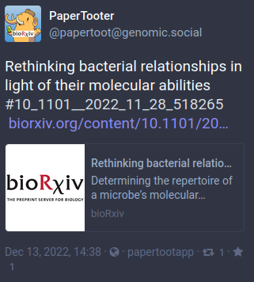

# papertooter
A script to post manuscripts from BioRxiv to Mastodon using a unique hashtag based on the manuscript DOI.

## Purpose

The purpose of this program is to post ("toot") a [BioRxiv](https://www.biorxiv.org/),
[medRxiv](https://www.medrxiv.org) or [arXiv](https://arxiv.org) preprint on the Mastodon social network.
You would need a Mastodon account, and you would need to connect it to Mastodon using Mastodon.py. To post
the bioarxiv preprint you would run the following from the command line:

`$ python papertoot.py -c mastodon_user_credentials_file http://biorxiv.org/paper_url `

This will create a post on Mastodon using your account with the paper title, a hashtag based on the paper
DOI, and a link to the paper. 

### Hashtag

The hashtag is based on the paper DOI. In Biorxiv the DOI is composed of alphanumeric characters, slashes
and periods. Because hashtags do not allow periods and slashes, a `/` is converted to a `__` (double
underscore) and any other non-alphanumeric os underscore character is converted to a `_` (single
underscore). This allows for a (mostly)  tagging of the manuscript. So the DOI `DOI:10.1101/2022.11.28.518265`
will be converted to `#10_1101__2022_11_28_518265`.


### Dependencies
 + [BeautifulSoup](https://www.crummy.com/software/BeautifulSoup/)
 + [requests](https://requests.readthedocs.io/en/latest/)
 + [mastodon.py](https://github.com/halcy/Mastodon.py)
 
### Prerequsites
You will need 
 + A Mastodon account
 + Mastodon user credentials so you could toot from the Python script. To learn how to generate the
   credentials, see the top of the README file in [Mastodon.py](https://github.com/halcy/Mastodon.py)
 
 
### Command line options:

```
-h, --help               show this help message and exit
-v, --verbose            debug information mostly
-s, --silent             silent: do not toot
-c CREDS, --creds CREDS  Mastodon user credentials file

```


### Example:




